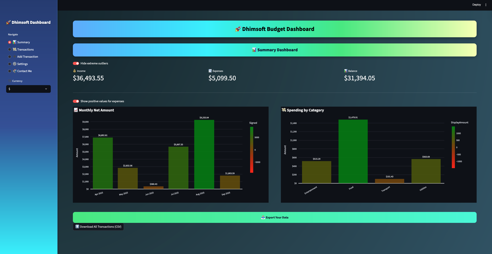

# 🌐 Dhimy Jean – Portfolio Website  

  
  
  

This is my **personal static portfolio website**, showcasing projects, skills, education, and professional highlights.  
Built with **HTML, CSS, and JavaScript**, it demonstrates my ability to deliver **responsive, accessible, and visually engaging web experiences**.  

🔗 **Live Site:** [dhimsoft.github.io/dhimsoft-portfolio-static](https://dhimsoft.github.io/dhimsoft-portfolio-static)  
🔗 **Main Domain:** [dhimsoft.com](https://dhimsoft.com)  

---

## ✨ Features  

- 📂 **Featured Projects** — Interactive cards with screenshots + GitHub & live demo links.  
- 💻 **Skills Section** — Covers front-end, back-end, and cloud technologies.  
- 👤 **About Me** — Career journey from **Royal Caribbean** to **NYC DOE** to **CS/AI path**.  
- 🎓 **Education** — A.S. in Computer Science (**BMCC**, expected 2026) + Technologist in Software Engineering (**UTESA**).  
- 📱 **Responsive Design** — Works seamlessly across desktop & mobile.  

---

## 🚀 Tech Stack  

- **HTML5**  
- **CSS3** (custom styles + glassmorphism UI)  
- **JavaScript (Vanilla)**  
- **Static Hosting** via GitHub Pages  

---

## 📸 Screenshots  

### Homepage  
  

### Featured Projects  

#### 1. Dhimsoft Budget Dashboard  
  
🔗 [Live Demo](https://dhimsoft-budget-tracker-ikcpchd3xjv6u7rkf7gvih.streamlit.app/) | 🔗 [GitHub Repo](https://github.com/dhimsoft/dhimsoft-budget-tracker)  

---

#### 2. MTA Data Analysis  
  
🔗 [GitHub Repo](https://github.com/dhimsoft/mta_bus_project_dhimyjean)  

---

#### 3. Dhimsoft Academy Website (Prototype)  
  
🔗 [Live Demo](https://dhimsoft-academy.vercel.app) | 🔗 [GitHub Repo](https://github.com/dhimsoft/dhimsoft-academy)  

---

## 🤝 Contributing  
Contributions are welcome! See [CONTRIBUTING.md](CONTRIBUTING.md) for guidelines.  

---

## 👨‍💻 Author  

**Dhimy Jean**  
🎓 Computer Science Student @ CUNY BMCC  
💻 Technologist | Data & AI Enthusiast | Software Developer  

📧 [dhimyjean@dhimsoft.com](mailto:dhimyjean@dhimsoft.com)  
🌐 [dhimsoft.com](https://dhimsoft.com)  
🔗 [GitHub](https://github.com/dhimsoft)  
🔗 [LinkedIn](https://linkedin.com/in/dhimy-jean)  

---

## 📄 License  
This project is licensed under the [MIT License](LICENSE).  

---

## 🔮 Future Enhancements  

- 🌙 Add dark mode toggle  
- 🖼️ Animated lightbox gallery for projects  
- 📈 Analytics integration (visitor tracking)  
- ✍️ Blog / technical articles section  

---

⚡ *Built with ❤️ to turn **complexity into clarity** through software, data, and design.*  
